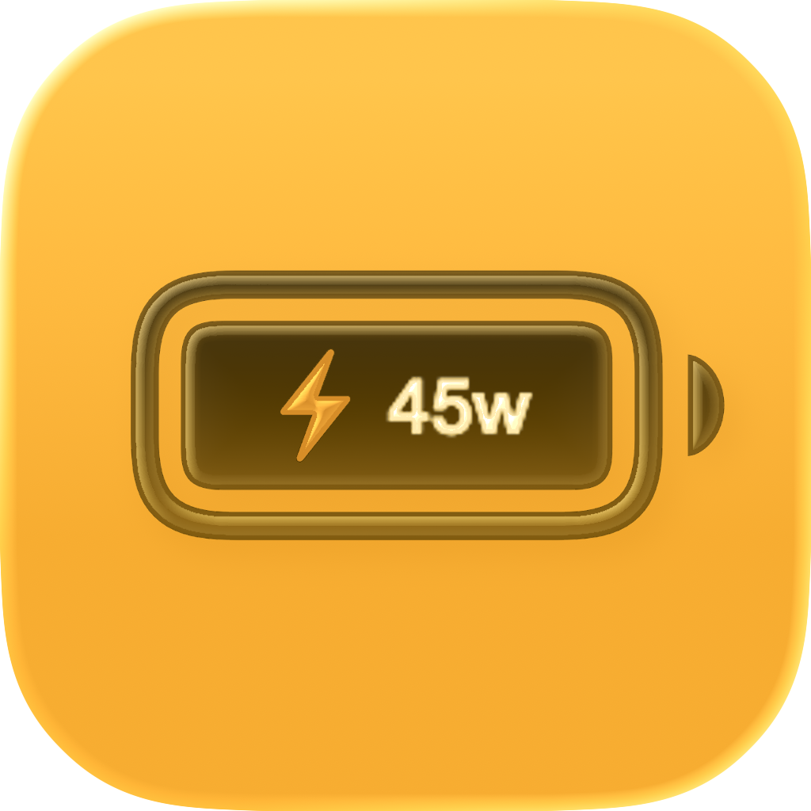

# Charging Power Menu Bar



A native macOS menu bar app for checking charging power, battery percentage, and battery health at a glance.

## Highlights

- Shows charging watts while the Mac is on AC power.
- Shows battery percentage while running on battery.
- Uses a compact battery icon with level-based states.
- Displays `Current Charge`, `Maximum Capacity`, and `Condition` in the dropdown menu.
- Includes `Launch at Login` support.
- Lets you refresh metrics instantly with `Update now`.

## Designed For

- Users who want a lightweight charging indicator in the menu bar.
- People who prefer a clean Apple-style utility with minimal visual noise.
- Macs running macOS `13` or later.

## How It Behaves

- On AC power, the menu bar title shows charging watts when available.
- If wattage is not available, it falls back to `AC`.
- On battery power, the menu bar title shows the current battery percentage.
- The app updates more frequently while charging and less often on battery to reduce overhead.
- `Maximum Capacity` and `Condition` refresh on launch and when you choose `Update now`.

## Features

- Native macOS menu bar app.
- Small, readable status text.
- Adaptive polling based on power source.
- Battery icon with 25% level gradations.
- Manual refresh from the menu.
- Login item toggle powered by `SMAppService`.

## Build and Run

```bash
swift build
swift run
```

## Build and Install

Use the helper script to build, sign, and install the app bundle:

```bash
./scripts/build_and_install_app.sh
```

After the script finishes:
- build output: `dist/PowerApp.app`;
- installed app: `/Applications/PowerApp.app`.

You can override the script defaults if needed:

- `APP_DISPLAY_NAME=PowerApp`
- `EXECUTABLE_NAME=ChargingPowerMenuBar`
- `BUNDLE_ID=com.grigorym.ChargingPowerMenuBar`

## Project Structure

- `Sources/ChargingPowerMenuBar/ChargingPowerMenuBar.swift` - main app logic and battery readers.
- `scripts/build_and_install_app.sh` - build, sign, package, and install flow.
- `Assets/` - app icon assets and source image.

## Notes

- The app is built as a menu bar utility, so it runs without a Dock icon.
- If you update the icon, rerun the build script so the packaged app picks up the new asset.
- Battery health values come from macOS smart battery properties.

## License

Apache-2.0. See [LICENSE](LICENSE).
